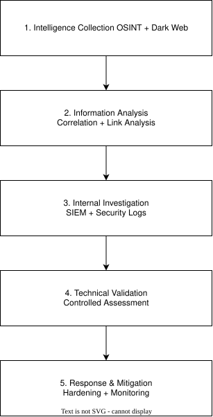

# OSINT & Dark Web Threat Intelligence for Corporate Security

> An academic cybersecurity project exploring the integration of Dark Web
> monitoring, OSINT, SIEM analysis and controlled vulnerability assessment
> within a simulated corporate security incident.

<p align="center">
  
</p>

## Overview

The continuous evolution of cyber threats requires organizations to adopt a proactive approach to protecting their information, systems, and digital assets. The **Dark Web** represents a particularly relevant source of threat intelligence, as compromised credentials, stolen data, and other sensitive information may be exchanged through services accessible via specialized networks such as Tor.

This project explores how **Open Source Intelligence (OSINT)** and **Dark Web monitoring** can be integrated into a broader corporate cybersecurity strategy to support threat identification, investigation, and incident response.

Developed as part of my Bachelor's thesis in Computer Science, the project combines theoretical research with a practical case study based on a simulated technology startup operating in a financial/data-driven domain affected by a security incident involving compromised employee credentials.

The case study investigates an integrated security workflow involving:

* **Dark Web monitoring and OSINT** to identify potentially exposed information and investigate external threat indicators.
* **Entity and relationship analysis** to correlate information collected from different sources.
* **SIEM and log analysis** to investigate security events within the monitored environment.
* **Controlled vulnerability assessment** to validate potential weaknesses identified during the investigation.
* **Mitigation and continuous monitoring** to reduce exposure and improve the organization's security posture.

The practical environment was implemented as an isolated virtualized lab, separating **OSINT/Dark Web monitoring**, **SIEM and log management**, and **penetration-testing activities** into dedicated environments.

The project demonstrates how external threat intelligence can complement internal security monitoring and technical validation, while also highlighting the importance of employee awareness, security policies, continuous monitoring, and responsible handling of sensitive information.

## Key Areas

The project brings together several complementary areas of cybersecurity research and practical investigation:

- **OSINT & Dark Web Intelligence**: collection and analysis of potentially exposed organizational information from open and Dark Web sources.
- **Threat Intelligence**: investigation and correlation of external indicators to identify potential security risks.
- **Entity & Link Analysis**: connecting people, organizations, domains, email addresses and other indicators to build investigative context.
- **SIEM & Log Analysis**: collection and investigation of Windows security events using Splunk Enterprise.
- **Vulnerability Assessment**: controlled validation of potential security weaknesses using Kali Linux and Metasploit Framework.
- **Security Research Lab**: isolated virtualized environments designed to separate OSINT, monitoring and security-testing activities.
- **Incident Response & Mitigation**: analysis of potential response, remediation and continuous-monitoring measures.
- **Ethics & Privacy**: consideration of authorization, data minimization, responsible OSINT and safe handling of sensitive information.

## Architecture

The practical environment was designed as an isolated virtualized security lab, with different activities separated into dedicated environments.

The architecture is organized around three main security functions:

- **OSINT & Dark Web Monitoring**: dedicated environment for OSINT research, Dark Web access and external intelligence collection.
- **SIEM & Log Management**: environment used to collect and analyze security-related events generated within the monitored systems.
- **Penetration Testing**: dedicated environment for controlled reconnaissance and vulnerability assessment.

This separation helps reduce interaction between potentially risky research activities and the other components of the laboratory while providing a structured workflow from external intelligence collection to internal investigation and technical validation.

### Investigation Flow

```text
External Intelligence
        ↓
OSINT / Dark Web Research
        ↓
Information Correlation
        ↓
SIEM & Log Analysis
        ↓
Controlled Vulnerability Assessment
        ↓
Mitigation & Continuous Monitoring
```

For a detailed breakdown of the environments, isolation strategy and information flow, see [`docs/architecture.md`](docs/architecture.md).

## Technologies

The practical implementation combines virtualization, Linux-based security environments, OSINT and Dark Web intelligence, SIEM analysis, and controlled vulnerability assessment.

| Category | Technologies |
|---|---|
| Virtualization | Oracle VM VirtualBox |
| Operating Systems | Ubuntu Linux, Kali Linux |
| Dark Web Access | Tor Browser |
| Dark Web Intelligence | DarkOwl Vision |
| OSINT & Link Analysis | Maltego |
| SIEM & Log Analysis | Splunk Enterprise |
| Vulnerability Assessment | Metasploit Framework |

> **Note:** The thesis also evaluates a broader set of OSINT and cybersecurity technologies, including OSINT Framework, SpiderFoot, Shodan, Have I Been Pwned, Nmap, Burp Suite, Scrapy, Zeek, Suricata and others. These are documented separately and should not be interpreted as technologies all implemented hands-on in the practical case study.
>
> See [`docs/tools-evaluated.md`](docs/tools-evaluated.md) for the complete technology assessment and the distinction between practically demonstrated, evaluated, and referenced technologies.

## Methodology

The project follows a structured investigation workflow that combines external intelligence collection, information correlation, internal monitoring, and controlled technical validation.

<p align="center">
  
</p>

The investigation follows five stages:

**Intelligence Collection → Correlation → SIEM Investigation → Technical Validation → Response & Monitoring**

For the complete workflow and methodological scope, see [`docs/methodology.md`](docs/methodology.md).

## Case Study

The practical component of the thesis is based on a **simulated security incident affecting a technology and financial startup**.

The scenario begins with a phishing and social-engineering attack resulting in the compromise of an employee's corporate credentials. The investigation then follows the potential exposure and technical implications of the compromise through multiple security layers.

### Investigation Workflow

```text
Phishing / Social Engineering
             ↓
      Credential Compromise
             ↓
      Dark Web Monitoring
             ↓
       OSINT Correlation
             ↓
       SIEM Investigation
             ↓
   Controlled Vulnerability
          Assessment
             ↓
     Mitigation & Monitoring
```

**SIEM Investigation: Splunk Enterprise**  
Windows event logs were collected and analyzed in Splunk to investigate security activity within the simulated environment.

<p align="center">
  
</p>

**Controlled Vulnerability Assessment: Metasploit Framework**  
Metasploit was used to validate the MS17-010 vulnerability hypothesis against the authorized test system; the target was not identified as vulnerable.

<p align="center">
  
</p>

For the complete incident scenario and investigation phases, see [`docs/case-study.md`](docs/case-study.md).

## Results

The case study demonstrated how external intelligence and internal security monitoring can be combined to investigate a simulated credential-compromise scenario.

| Area | Result |
|---|---|
| Dark Web Intelligence | Demonstrated the identification and analysis of potentially exposed organizational information |
| OSINT Correlation | Demonstrated how information from multiple sources can be correlated to build investigative context |
| SIEM Investigation | Used Splunk Enterprise to analyze Windows security events and investigate activity within the monitored environment |
| Vulnerability Assessment | Assessed the simulated target for the MS17-010 SMB vulnerability using Metasploit Framework |
| Vulnerability Outcome | The tested target was not identified as vulnerable to the assessed MS17-010 condition |
| Defensive Response | Identified monitoring, credential protection, hardening and continuous security-awareness measures as relevant mitigation strategies |

### Key Findings

- **External intelligence can provide an early indication of potential organizational exposure**, before or alongside internal security investigations.
- **OSINT findings become more valuable when correlated with other sources**, rather than being treated as isolated indicators.
- **Technical validation should remain controlled and authorized**, using the minimum level of interaction necessary to assess a security hypothesis.

The case study therefore supports the thesis' central proposition: **combining OSINT, Dark Web monitoring and internal security telemetry can improve an organization's ability to identify, investigate and respond to potential security threats.**

For the detailed findings, evidence and limitations, see [`docs/results.md`](docs/results.md).

## Skills Demonstrated

This project demonstrates a combination of cybersecurity research, technical investigation, security tooling and analytical skills.

| Area | Skills Demonstrated |
|---|---|
| **Cybersecurity Research** | OSINT, Dark Web intelligence, threat monitoring, security research |
| **Threat Intelligence** | Information collection, indicator correlation, threat analysis, investigative workflows |
| **Security Analysis** | Log analysis, event investigation, vulnerability assessment |
| **OSINT** | Open-source information gathering, entity correlation, link analysis |
| **SIEM** | Windows event collection and analysis using Splunk Enterprise |
| **Vulnerability Assessment** | Controlled vulnerability validation using Kali Linux and Metasploit Framework |
| **Linux & Security Environments** | Linux-based security tooling and isolated virtualized laboratory environments |
| **Virtualization** | Design and configuration of a multi-environment security laboratory using VirtualBox |
| **Problem Solving** | Structured investigation, hypothesis validation, evidence correlation and technical troubleshooting |
| **Technical Documentation** | Research methodology, architecture documentation, technical analysis and security reporting |
| **Security & Privacy** | Responsible OSINT, data minimization, authorization, ethical handling of sensitive information |

## Challenges & Lessons Learned

Developing the case study required combining several areas of cybersecurity that are normally addressed independently. One of the main challenges was designing a coherent investigation workflow that connected external intelligence with internal security telemetry and technical validation.

### Key Challenges

- **Connecting heterogeneous information sources**  
  OSINT and Dark Web sources provide information in different formats and with different levels of reliability. Establishing meaningful relationships between collected information required correlation and validation rather than relying on individual findings.

- **Correlating external and internal evidence**  
  External intelligence alone does not necessarily confirm a security incident. Combining OSINT findings with Windows security events and SIEM analysis provided an additional perspective for investigating the simulated compromise.

- **Validating security hypotheses safely**  
  Potential vulnerabilities identified during an investigation should be validated within an authorized and controlled environment. The vulnerability-assessment stage therefore focused on testing the MS17-010 hypothesis without treating exploitation as the objective.

- **Handling sensitive information responsibly**  
  Research involving exposed credentials, personal information and Dark Web sources requires careful consideration of privacy, authorization, data minimization and publication practices.

### Lessons Learned

The project highlighted several important principles:

1. **Security investigations benefit from multiple sources of evidence.**  
   OSINT, Dark Web intelligence, system logs and vulnerability assessment provide different perspectives that become more useful when correlated.

2. **Information collection is only the beginning of an investigation.**  
   Findings must be analyzed, validated and placed into context before they can support a security decision.

3. **Isolation is an important part of security research.**  
   Separating research activities into controlled environments reduces unnecessary exposure and provides a safer platform for experimentation.

4. **Technical capability must be combined with responsible security practices.**  
   Authorization, privacy and appropriate handling of sensitive information are fundamental when working with OSINT and cybersecurity tools.

> These lessons influenced the final methodology and the recommendations presented in the project.

## Future Improvements

Potential extensions include:

- automating OSINT collection and indicator enrichment;
- integrating threat-intelligence feeds with SIEM workflows;
- developing custom Splunk detections and dashboards;
- expanding the controlled vulnerability-assessment environment;
- introducing additional endpoint and network telemetry;
- building a more automated end-to-end workflow from intelligence collection to detection and response.

Long-term, the project could evolve toward a more automated threat-intelligence and security-monitoring platform.

For the detailed roadmap to Future Improvements, see [`docs/future-work.md`](docs/future-work.md).

## Academic Context

This project originated from my **university thesis**, developed as an academic research project exploring the integration of **Dark Web intelligence and Open Source Intelligence (OSINT)** into organizational cybersecurity practices.

The thesis combines theoretical research on the Dark Web, OSINT methodologies, threat intelligence and cybersecurity technologies with a **practical simulated case study** designed to investigate how external intelligence can support security monitoring, vulnerability assessment and incident response.

This GitHub repository is not intended to reproduce the thesis chapter by chapter. Instead, it reorganizes the original research into a **technical portfolio project**, with emphasis on:

- the laboratory architecture;
- the investigation methodology;
- the practical case study;
- the technologies evaluated and demonstrated;
- the results and lessons learned;
- ethical, legal and privacy considerations.

### Original Thesis

The complete academic thesis is available here:

📄 **[Read the full thesis](docs/Thesis.pdf)**

> **Note:** The thesis represents the original academic work, while this repository provides a condensed and reorganized technical presentation of the project for portfolio and professional purposes.

### Thesis Information

| Info | Detail |
|---|---|
| **Degree** | Laurea in Informatica |
| **University** | Università degli Studi di Parma |
| **Academic Year** | 2023-2024 |
| **Thesis Title** | *Open Source Intelligence on the Dark Web: Tools and Techniques for Protecting Corporate Infrastructures* |

## Documentation

Detailed technical documentation is available in the [`docs/`](docs/) directory.

| Document | Description |
|---|---|
| **[Architecture](docs/architecture.md)** | Lab architecture, virtualized environments, component responsibilities, isolation strategy and information flow. |
| **[Methodology](docs/methodology.md)** | Investigation methodology covering intelligence collection, correlation, SIEM analysis, technical validation and response. |
| **[Case Study](docs/case-study.md)** | Practical simulated incident, from credential compromise and Dark Web monitoring to SIEM investigation and vulnerability assessment. |
| **[Results](docs/results.md)** | Key findings, outcomes, limitations and conclusions derived from the practical case study. |
| **[Tools & Technologies](docs/tools-evaluated.md)** | Technologies practically demonstrated, evaluated or referenced during the research, with a clear distinction between levels of usage. |
| **[Ethics, Legal & Responsible Use](docs/ethics-and-legal.md)** | Authorization, privacy, responsible OSINT, sensitive-data handling and ethical security-research considerations. |
| **[Original Thesis](docs/Thesis.pdf)** | Complete original academic thesis on which this portfolio project is based. |

### Repository Structure

```text
darkweb-osint-threat-intelligence/
│
├── README.md
│
├── docs/
│   ├── architecture.md
│   ├── methodology.md
│   ├── case-study.md
│   ├── results.md
│   ├── tools-evaluated.md
│   ├── ethics-and-legal.md
│   ├── future-work.md
│   └── Thesis.pdf
│
├── assets/
│   ├── architecture/
│   │   └── lab-architecture.svg
│   │
│   ├── case-study/
│   │   ├── darkowl-search-results.png
│   │   ├── maltego-link-analysis.png
│   │   ├── splunk-event-analysis.png
│   │   └── metasploit-ms17-010-scan.png
│   │
│   ├── lab/
│   │   ├── osint-monitoring/
│   │   │   └── osint-virtualbox-vm-configuration.png
│   │   ├── penetration-testing/
│   │   │   ├── kali-lab-environment.png
│   │   │   └── pentest-virtualbox-vm-configuration.png
│   │   └── siem/
│   │       └── siem-virtualbox-vm-configuration.png
│   │
│   └── methodology/
│       └── methodology-flow.svg
│
└── lab/
    ├── osint-monitoring/
    │   └── README.md
    ├── penetration-testing
    │   └── README.md
    └── siem
        └── README.md
```

## Ethical & Responsible Use

This project involves **OSINT, Dark Web research, security monitoring and vulnerability assessment**, all of which require careful consideration of authorization, privacy and responsible data handling.

All practical security-testing activities documented in this repository were performed within a **controlled academic laboratory environment**. The organization and security incident described in the case study are simulated.

The project follows several core principles:

- **Authorization**: security testing should only be performed against systems you own or have explicit permission to assess.
- **Defensive Purpose**: OSINT and Dark Web intelligence are used to investigate potential exposure and support defensive security activities.
- **Responsible OSINT**: publicly accessible information should still be collected, processed and shared with consideration for privacy and legitimate purpose.
- **Credential Safety**: exposed or leaked credentials must never be used to access systems without authorization.
- **Controlled Testing**: vulnerability assessment is performed in isolated and authorized environments.
- **Privacy & Data Minimization**: personal and sensitive information should be collected and retained only when necessary for the investigation.
- **Validation**: OSINT and Dark Web findings should be correlated and verified before conclusions or attribution are made.
- **Responsible Disclosure**: genuine vulnerabilities or sensitive exposures should be reported through appropriate channels rather than unnecessarily published.

> **Disclaimer:** This repository is provided for **educational, academic research and defensive-security purposes**. Nothing in this project should be interpreted as authorization to access systems without permission, misuse exposed credentials, bypass security controls, perform unauthorized security testing or unlawfully collect or redistribute sensitive information.

For the complete discussion of authorization, GDPR and privacy considerations, Dark Web research, sensitive-data handling and responsible disclosure, see [`docs/ethics-and-legal.md`](docs/ethics-and-legal.md).
