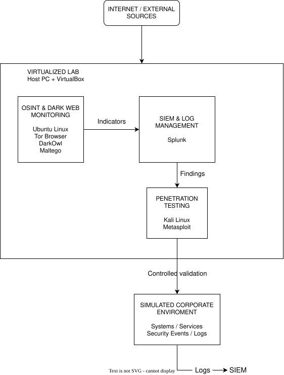
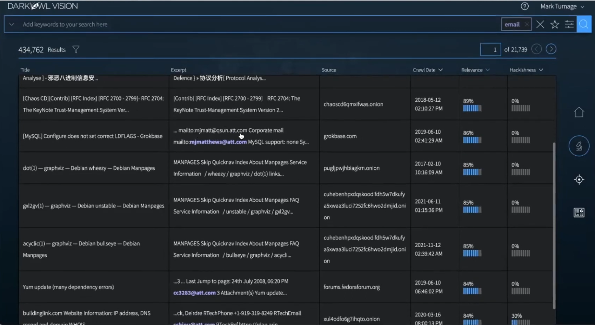
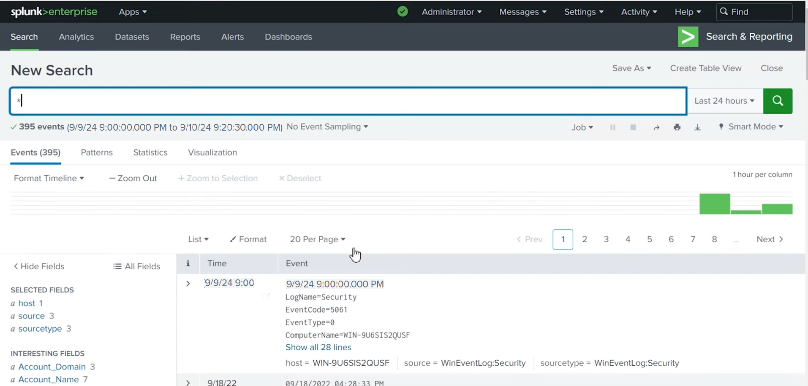
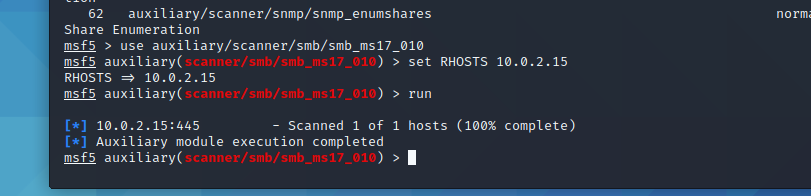

# OSINT & Dark Web Threat Intelligence for Corporate Security

> An academic cybersecurity project exploring the integration of Dark Web
> monitoring, OSINT, SIEM analysis and controlled vulnerability assessment
> within a simulated corporate security incident.

<p align="center">
  
</p>

## Overview

The continuous evolution of cyber threats requires organizations to adopt a proactive approach to protecting their information, systems, and digital assets. The **Dark Web** represents a particularly relevant source of threat intelligence, as compromised credentials, stolen data, and other sensitive information may be exchanged through services accessible via specialized networks such as Tor.

This project explores how **Open Source Intelligence (OSINT)** and **Dark Web monitoring** can be integrated into a broader corporate cybersecurity strategy to support threat identification, investigation, and incident response.

Developed as part of my Bachelor's thesis in Computer Science, the project combines theoretical research with a practical case study based on a simulated technology and financial startup affected by a security incident involving compromised employee credentials.

The case study investigates an integrated security workflow involving:

* **Dark Web monitoring and OSINT** to identify potentially exposed information and investigate external threat indicators.
* **Entity and relationship analysis** to correlate information collected from different sources.
* **SIEM and log analysis** to investigate security events within the monitored environment.
* **Controlled vulnerability assessment** to validate potential weaknesses identified during the investigation.
* **Mitigation and continuous monitoring** to reduce exposure and improve the organization's security posture.

The practical environment was implemented as an isolated virtualized lab, separating **OSINT/Dark Web monitoring**, **SIEM and log management**, and **penetration-testing activities** into dedicated environments.

The project demonstrates how external threat intelligence can complement internal security monitoring and technical validation, while also highlighting the importance of employee awareness, security policies, continuous monitoring, and responsible handling of sensitive information.

## Key Areas

The project brings together several complementary areas of cybersecurity research and practical investigation:

- **OSINT & Dark Web Intelligence**: collection and analysis of potentially exposed organizational information from open and Dark Web sources.
- **Threat Intelligence**: investigation and correlation of external indicators to identify potential security risks.
- **Entity & Link Analysis**: connecting people, organizations, domains, email addresses and other indicators to build investigative context.
- **SIEM & Log Analysis**: collection and investigation of Windows security events using Splunk Enterprise.
- **Vulnerability Assessment**: controlled validation of potential security weaknesses using Kali Linux and Metasploit Framework.
- **Security Research Lab**: isolated virtualized environments designed to separate OSINT, monitoring and security-testing activities.
- **Incident Response & Mitigation**: analysis of potential response, remediation and continuous-monitoring measures.
- **Ethics & Privacy**: consideration of authorization, data minimization, responsible OSINT and safe handling of sensitive information.

## Architecture

The practical environment was designed as an isolated virtualized security lab, with different activities separated into dedicated environments.

The architecture is organized around three main security functions:

- **OSINT & Dark Web Monitoring**: dedicated environment for OSINT research, Dark Web access and external intelligence collection.
- **SIEM & Log Management**: environment used to collect and analyze security-related events generated within the monitored systems.
- **Penetration Testing**: dedicated environment for controlled reconnaissance and vulnerability assessment.

This separation helps reduce interaction between potentially risky research activities and the other components of the laboratory while providing a structured workflow from external intelligence collection to internal investigation and technical validation.

### Investigation Flow

```text
External Intelligence
        ↓
OSINT / Dark Web Research
        ↓
Information Correlation
        ↓
SIEM & Log Analysis
        ↓
Controlled Vulnerability Assessment
        ↓
Mitigation & Continuous Monitoring
```

## Technologies

The practical implementation combines virtualization, Linux-based security environments, OSINT and Dark Web intelligence, SIEM analysis, and controlled vulnerability assessment.

| Category | Technologies |
|---|---|
| Virtualization | Oracle VM VirtualBox |
| Operating Systems | Ubuntu Linux, Kali Linux |
| Dark Web Access | Tor Browser |
| Dark Web Intelligence | DarkOwl Vision |
| OSINT & Link Analysis | Maltego |
| SIEM & Log Analysis | Splunk Enterprise |
| Vulnerability Assessment | Metasploit Framework |

> **Note:** The thesis also evaluates and discusses additional OSINT and cybersecurity technologies, including OSINT Framework, SpiderFoot, Shodan, Have I Been Pwned, Nmap, Burp Suite, Scrapy, Zeek, Suricata and others. These are documented separately and should not be interpreted as technologies all implemented hands-on in the practical case study.
>
> See [`docs/tools-evaluated.md`](docs/tools-evaluated.md) for the complete technology assessment and the distinction between practically demonstrated, evaluated, and referenced technologies.

## Methodology

The project follows a structured investigation workflow that combines external intelligence collection, information correlation, internal monitoring, and controlled technical validation.

```text
┌──────────────────────────────┐
│  1. Intelligence Collection  │
│     OSINT + Dark Web          │
└──────────────┬───────────────┘
               ↓
┌──────────────────────────────┐
│  2. Information Analysis     │
│     Correlation + Link        │
│     Analysis                  │
└──────────────┬───────────────┘
               ↓
┌──────────────────────────────┐
│  3. Internal Investigation   │
│     SIEM + Security Logs      │
└──────────────┬───────────────┘
               ↓
┌──────────────────────────────┐
│  4. Technical Validation     │
│     Controlled Assessment     │
└──────────────┬───────────────┘
               ↓
┌──────────────────────────────┐
│  5. Response & Mitigation    │
│     Hardening + Monitoring    │
└──────────────────────────────┘
```

## Case Study

The practical component of the thesis is based on a **simulated security incident affecting a technology and financial startup**.

The scenario begins with a phishing and social-engineering attack resulting in the compromise of an employee's corporate credentials. The investigation then follows the potential exposure and technical implications of the compromise through multiple security layers.

### Investigation Workflow

```text
Phishing / Social Engineering
             ↓
      Credential Compromise
             ↓
      Dark Web Monitoring
             ↓
       OSINT Correlation
             ↓
       SIEM Investigation
             ↓
   Controlled Vulnerability
          Assessment
             ↓
     Mitigation & Monitoring
```

<p align="center">  </p>
<p align="center">  </p>
<p align="center">  </p>

## Results

The case study demonstrated how external intelligence and internal security monitoring can be combined to investigate a simulated credential-compromise scenario.

| Area | Result |
|---|---|
| Dark Web Intelligence | Demonstrated the identification and analysis of potentially exposed organizational information |
| OSINT Correlation | Demonstrated how information from multiple sources can be correlated to build investigative context |
| SIEM Investigation | Used Splunk Enterprise to analyze Windows security events and investigate activity within the monitored environment |
| Vulnerability Assessment | Assessed the simulated target for the MS17-010 SMB vulnerability using Metasploit Framework |
| Vulnerability Outcome | The tested target was not identified as vulnerable to the assessed MS17-010 condition |
| Defensive Response | Identified monitoring, credential protection, hardening and continuous security-awareness measures as relevant mitigation strategies |

### Key Findings

- **External intelligence can provide an early indication of potential organizational exposure**, before or alongside internal security investigations.
- **OSINT findings become more valuable when correlated with other sources**, rather than being treated as isolated indicators.
- **SIEM-based log analysis provides an internal perspective** that can be used to investigate and validate suspicious activity.
- **Technical validation should remain controlled and authorized**, using the minimum level of interaction necessary to assess a security hypothesis.
- **Continuous monitoring and preventive measures are essential** because exposed information and emerging threats can change over time.

The case study therefore supports the thesis' central proposition: **combining OSINT, Dark Web monitoring and internal security telemetry can improve an organization's ability to identify, investigate and respond to potential security threats.**

For the detailed findings, evidence and limitations, see [`docs/results.md`](docs/results.md).
