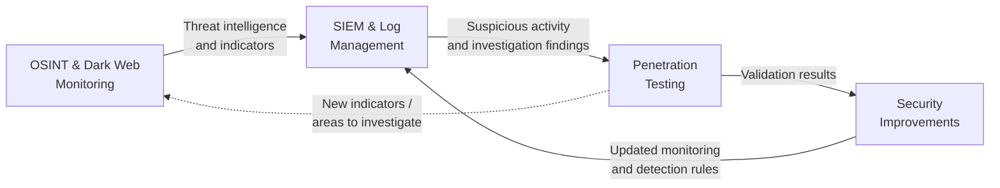

# Lab Architecture

## Overview

The practical case study was designed around an **isolated virtualized cybersecurity lab** used to investigate how OSINT and Dark Web intelligence can support the protection of corporate assets.

The environment separates the main stages of the investigation into dedicated systems:

1. **OSINT & Dark Web Monitoring**
2. **SIEM & Log Management**
3. **Penetration Testing**

Each environment has a specific responsibility within the security workflow, from collecting external intelligence to analyzing security events and validating potential vulnerabilities.

The separation of these functions was intended to reduce the impact of a potential compromise during Dark Web research or security testing while providing a controlled environment in which monitoring, investigation and vulnerability assessment activities could be performed.

<p align="center">
  
</p>

<p align="center">
  <em>High-level architecture of the virtualized environment used for the case study.</em>
</p>

---

## Design Goals

The architecture was designed around four main principles.

### Isolation

Dark Web research and security testing can expose a system to potentially malicious content or unintended interactions. Virtual machines provide isolated environments in which these activities can be separated from the host system and from one another.

### Separation of Responsibilities

Rather than performing every activity from a single machine, the environment separates **intelligence collection**, **security monitoring** and **technical validation**.

This provides a clearer security workflow and limits the scope of each environment.

### Controlled Security Testing

Penetration-testing activities are performed from a dedicated Kali Linux environment against authorized systems within the simulated scenario.

This allows potential vulnerabilities to be investigated without conducting tests against unauthorized external infrastructure.

### Intelligence-Driven Investigation

The environments are not intended to operate independently. Information discovered during OSINT and Dark Web monitoring can provide indicators for SIEM investigation, while suspicious activity identified through monitoring can guide more targeted security validation.

The results can then be used to improve monitoring rules, security configurations and future investigations.

---

## Host Environment

The lab is hosted on a primary machine running **Oracle VM VirtualBox**, which provides the virtualization layer for the different security environments.

The architecture consists of three functionally separated virtual machines connected through the host environment.

A firewall is included in the architectural design to control network traffic, reduce unauthorized access and monitor communications entering and leaving the environment.

The use of separate virtual machines also helps contain the potential impact of a compromised environment by limiting activities associated with Dark Web monitoring, log analysis and penetration testing to their respective systems.

---

## 1. OSINT & Dark Web Monitoring Environment

The first environment is based on **Ubuntu Linux** and is dedicated to external intelligence collection and Dark Web research.

Its primary responsibilities include:

* collecting publicly available information related to the organization;
* monitoring Dark Web sources for organizational mentions;
* identifying potentially exposed credentials or sensitive information;
* investigating indicators associated with possible compromise;
* correlating entities and relationships discovered during the investigation.

The practical case study uses **Tor Browser** for Dark Web access and **DarkOwl Vision** for searching and analyzing information available through monitored Dark Web sources.

**Maltego** is subsequently used for link analysis, allowing collected information to be represented as entities and relationships. Examples of entities considered during the research include people, organizations, websites, IPv4 addresses, cryptocurrency addresses and social-media accounts.

The thesis also evaluates additional OSINT technologies such as SpiderFoot and Shodan as potential components of the wider intelligence-gathering workflow.

> **Security consideration:** Dark Web access and analysis are deliberately separated from the other security functions to reduce the exposure of the remaining environment to potentially malicious content.

---

## 2. SIEM & Log Management Environment

The second environment is dedicated to **security-event monitoring and log analysis**.

The case study uses **Splunk** to collect, search and visualize system events.

The monitored event categories include:

* Application events
* Security events
* System events

The SIEM layer represents the connection between externally collected intelligence and activity observed within the monitored environment.

Relevant intelligence discovered through OSINT or Dark Web monitoring, such as compromised credentials, suspicious IP addresses, malicious domains or other indicators of compromise, can be used to guide monitoring and correlation rules.

This allows the investigation to move from:

**"Has information related to the organization been exposed externally?"**

to:

**"Can activity associated with that information be identified within the monitored environment?"**

Dashboards, event searches and correlation rules can then support the identification and investigation of suspicious activity.

---

## 3. Penetration Testing Environment

The third environment uses **Kali Linux** and is dedicated to controlled security validation.

Its purpose is to investigate whether weaknesses identified through intelligence gathering or security monitoring can be reproduced or validated within an authorized environment.

The practical case study demonstrates this stage using **Metasploit**.

For example, an SMB vulnerability assessment was performed using the MS17-010 scanner module. The tested system was found **not to be susceptible to the examined vulnerability**, demonstrating that the purpose of this stage is validation rather than assuming that an identified attack vector is exploitable.

The thesis also considers tools such as Nmap and Burp Suite as part of the broader penetration-testing toolkit.

---

## Information Flow

The main architectural concept is the flow of information between the three environments.



### 1. Intelligence Collection

The OSINT/Dark Web environment collects information concerning the organization from external sources.

Relevant findings can include:

* potential compromises;
* exposed credentials;
* mentions on underground forums;
* suspicious domains or IP addresses;
* other indicators associated with malicious activity.

### 2. Monitoring and Correlation

Relevant indicators can then be incorporated into the SIEM investigation.

The monitoring environment can search for related activity and generate alerts when suspicious behavior is detected.

### 3. Targeted Validation

Findings from the SIEM can guide the penetration-testing stage.

Instead of testing systems without context, the security assessment can focus on areas highlighted during the previous investigation.

For example, suspicious activity associated with a particular exposed service could justify further validation of that service within the authorized test environment.

### 4. Feedback and Improvement

The results of security validation can feed back into the monitoring process.

Confirmed weaknesses can lead to actions such as:

* patching vulnerable systems;
* strengthening configurations;
* updating SIEM detection and correlation rules;
* investigating additional external intelligence;
* expanding monitoring for newly identified indicators.

This creates a feedback loop in which **external intelligence, internal monitoring and technical validation complement one another**.

---

## Security and Isolation Considerations

Isolation is an important component of the architecture because the project involves both Dark Web research and security-testing activities.

Virtualization provides a controlled boundary between the different functions of the lab and the host environment.

The architecture therefore follows a basic principle of **functional separation**:

| Environment                 | Primary Function                                |
| --------------------------- | ----------------------------------------------- |
| OSINT & Dark Web Monitoring | External intelligence collection and analysis   |
| SIEM & Log Management       | Event monitoring, correlation and investigation |
| Penetration Testing         | Controlled vulnerability validation             |

This separation reduces unnecessary interaction between environments and limits the potential impact of security-sensitive activities.

The architecture should be understood as an **academic and experimental lab design**, rather than a production-ready enterprise security architecture. A real-world deployment would require additional controls covering areas such as network segmentation, access management, centralized authentication, secure data transfer, endpoint protection, logging infrastructure and formal incident-response procedures.

---

## Architecture in the Investigation Lifecycle

The architecture supports the broader workflow explored by the case study:

```text
External Intelligence
        ↓
OSINT & Dark Web Monitoring
        ↓
Indicator Identification
        ↓
SIEM / Log Investigation
        ↓
Targeted Security Validation
        ↓
Mitigation
        ↓
Updated Monitoring & Security Controls
        ↺
```

This design demonstrates how Dark Web intelligence can be treated not as an isolated source of information, but as an input into a wider security investigation and continuous-improvement process.

---

## Related Documentation

* [Methodology](methodology.md): investigation and intelligence-gathering methodology
* [Case Study](case-study.md): simulated corporate security incident
* [Results](results.md): findings and outcomes of the practical experiment
* [Tools Evaluated](tools-evaluated.md): technologies used and researched during the project
* [Ethics & Legal Considerations](ethics-and-legal.md): responsible use, authorization and privacy considerations
