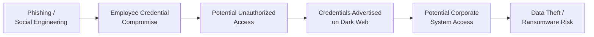
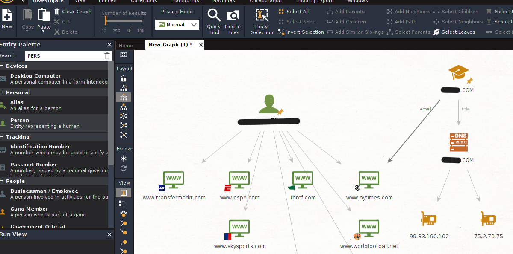

# Case Study

## Overview

To demonstrate the practical application of the proposed OSINT and Dark Web intelligence workflow, the project develops a **simulated corporate security incident** involving a medium-sized technology startup.

The case study follows the incident from an initial credential compromise through external intelligence gathering, information correlation, internal event analysis and controlled vulnerability validation.

The objective is not to reproduce a complete enterprise incident-response operation, but to demonstrate how different security disciplines can complement one another within a structured investigation.

---

## Scenario

The simulated organization is a technology startup with approximately **70 employees**, operating for around five years and developing revenue-management software.

Its digital environment includes:

* a corporate website;
* a web application;
* a mobile application;
* corporate email accounts;
* customer information;
* proprietary business information and source code.

These assets make employee credentials and corporate systems potentially valuable targets for attackers.

---

## Threat Scenario

The simulated incident begins with a **phishing and social-engineering attack** targeting employees of the organization.

The scenario assumes that an employee interacts with a malicious link and provides corporate credentials to an attacker.

The compromised credentials create the possibility of unauthorized access to organizational systems. The scenario subsequently considers those credentials being advertised through a Dark Web forum, potentially enabling other threat actors to purchase access to the organization.

The resulting attack path can be represented as:



The final stages represent **potential consequences of the simulated compromise**, rather than confirmed events observed against a real organization.

---

## Investigation Objectives

The case study investigates whether an integrated security workflow can help answer several questions:

* Can potentially exposed organizational information be identified through OSINT and Dark Web monitoring?
* Can collected information be correlated to provide additional context?
* Can external intelligence support investigation of internal security events?
* Can suspected technical weaknesses be validated within a controlled environment?
* What containment and mitigation measures would be appropriate following the investigation?

The investigation follows the methodology documented in [Methodology](methodology.md).

---

# Phase 1 — Dark Web Intelligence Collection

The first phase focuses on identifying external information that could indicate organizational exposure.

Research is performed from the dedicated **OSINT & Dark Web Monitoring environment** using an Ubuntu-based virtual machine.

Access to Dark Web resources is separated from the other lab functions, while **Tor Browser** provides access to services hosted through the Tor network.

## DarkOwl Vision

The practical research uses **DarkOwl Vision** as a Dark Web intelligence platform.

The platform allows searches to be performed using indicators such as:

* domains;
* organization names;
* email addresses;
* credentials;
* other identifiers associated with an investigation.

Search results provide contextual information including the source, crawl date and relevance indicators.

<p align="center">
  
</p>

<p align="center">
  <em>Example of DarkOwl Vision search results examined during the research.</em>
</p>

The screenshot above demonstrates the search and analysis functionality explored during the thesis. It should not be interpreted as evidence that the displayed results belong to the simulated organization.

The objective of this phase is to identify information potentially relevant to the investigation and determine which findings justify further analysis.

---

# Phase 2 — OSINT Analysis & Correlation

Information discovered through OSINT or Dark Web monitoring becomes more useful when relationships between individual data points can be identified.

The project uses **Maltego** to explore this concept through entity and link analysis.

Relevant entities may include:

* people;
* organizations;
* domains and websites;
* IPv4 addresses;
* email addresses;
* social-media accounts;
* cryptocurrency addresses.

Maltego represents these elements as nodes connected through relationships, allowing an analyst to investigate how apparently independent pieces of information may relate to one another.

<p align="center">
  
</p>

<p align="center">
  <em>Sanitized example of entity and relationship analysis performed with Maltego.</em>
</p>

The purpose of this phase is to transform isolated findings into **contextualized intelligence** that can support subsequent investigation.

---

# Phase 3 — SIEM Investigation

The investigation then moves from external intelligence to activity visible within the monitored environment.

**Splunk Enterprise** is used to collect, search and analyze Windows event logs.

The case study considers three primary event categories:

* `Application`
* `Security`
* `System`

Splunk allows events to be investigated using attributes such as:

* host;
* source;
* source type;
* event code;
* timestamp.

<p align="center">
  
</p>

<p align="center">
  <em>General event search performed in Splunk during the practical case study.</em>
</p>

This stage demonstrates how externally collected intelligence can provide additional context for internal monitoring.

For example, an indicator discovered during OSINT research could be incorporated into SIEM searches or correlation logic to investigate whether related activity is present within organizational logs.

Conceptually:

```text
External Indicator
        ↓
   SIEM Search
        ↓
Log / Event Correlation
        ↓
Suspicious Activity?
        ↓
Further Investigation
```

The project therefore treats external threat intelligence and internal event monitoring as complementary sources of information rather than independent security activities.

---

# Phase 4 — Controlled Vulnerability Validation

Potential weaknesses identified during an investigation should not automatically be treated as confirmed vulnerabilities.

The fourth phase therefore introduces **controlled technical validation** using the dedicated Kali Linux penetration-testing environment.

The case study uses **Metasploit Framework** to demonstrate this process.

## SMB / MS17-010 Assessment

An SMB service accessible on port `445` was assessed using Metasploit's MS17-010 scanner module.

The module was configured against the authorized target in the lab environment and executed to determine whether the system appeared susceptible to the vulnerability.

<p align="center">
  
</p>

<p align="center">
  <em>Controlled MS17-010 SMB vulnerability assessment performed using Metasploit.</em>
</p>

The assessment completed without identifying the tested target as vulnerable to MS17-010.

This is an important outcome of the case study.

A potential attack vector or exposed service is **not equivalent to a confirmed exploitable vulnerability**. Technical hypotheses generated during intelligence gathering or security monitoring should be validated before conclusions are drawn.

The objective of this phase is therefore **validation**, not exploitation.

---

# Phase 5 — Mitigation & Response

Following investigation and validation, the case study considers appropriate containment, remediation and prevention measures.

Depending on the nature of the findings, these may include:

### Account Security

* reset potentially compromised credentials;
* invalidate existing sessions;
* require re-authentication;
* review access associated with affected accounts.

### Network and System Security

* isolate systems suspected of compromise;
* block malicious or suspicious IP addresses and domains;
* patch identified vulnerabilities;
* strengthen system configurations;
* review firewall rules.

### Detection and Monitoring

* incorporate relevant indicators into SIEM monitoring;
* update detection and correlation rules;
* continue monitoring OSINT and Dark Web sources;
* investigate newly identified indicators.

### Organizational Measures

* improve phishing and social-engineering awareness;
* provide continuous cybersecurity training;
* maintain documented Standard Operating Procedures (SOPs);
* maintain and periodically test incident-response procedures;
* conduct authorized vulnerability assessments and penetration tests.

These measures represent **recommended responses derived from the case-study investigation** and should not be interpreted as controls that were all technically deployed within the academic lab.

---

# Key Findings

The practical case study highlights several observations.

### External Intelligence Can Provide Investigation Context

OSINT and Dark Web monitoring can provide information about potential organizational exposure that may not be visible exclusively through internal security controls.

### Correlation Adds Context to Raw Information

Individual domains, email addresses, IP addresses or identities provide limited value in isolation. Entity and relationship analysis can help establish context between collected information.

### External and Internal Visibility Complement Each Other

External intelligence can guide SIEM investigation, while internal security events can help determine whether externally discovered indicators are relevant to activity within the monitored environment.

### Technical Validation Is Essential

The MS17-010 assessment demonstrates an important principle: identifying a possible attack vector does not prove that a system is vulnerable.

The tested system was not identified as susceptible to the examined vulnerability, showing why security hypotheses should be technically validated before being treated as confirmed findings.

---

# Lessons Learned

The case study demonstrates several broader lessons applicable to security investigations:

* **Define the objective before collecting data.** OSINT can generate significant amounts of information, not all of which is relevant.
* **Separate sensitive activities.** Dark Web research and security testing benefit from isolated environments.
* **Do not treat collected intelligence as automatically trustworthy.** Information should be validated and correlated with additional evidence.
* **Context matters.** Indicators become more useful when their relationships and relevance to the organization are understood.
* **Use intelligence to guide investigation.** External findings can help prioritize internal monitoring and technical assessment.
* **Negative results are still valuable.** A vulnerability assessment that does not confirm a suspected weakness prevents incorrect conclusions and unnecessary remediation.
* **Security is both technical and organizational.** Monitoring and vulnerability assessment must be complemented by employee awareness, policies and incident-response preparation.

---

# Scope & Limitations

This case study was developed as an **academic simulation in a controlled laboratory environment**.

The following limitations therefore apply:

* the organization and incident scenario are simulated;
* the credential-compromise and Dark Web exposure form part of the case-study scenario and do not represent a documented breach of a real organization;
* only a subset of the technologies researched in the thesis were practically demonstrated;
* the project does not represent a complete production SOC or enterprise incident-response implementation;
* the evaluation is primarily qualitative rather than a quantitative benchmark of detection accuracy or response performance;
* vulnerability testing was limited to controlled and authorized systems;
* information obtained from OSINT or Dark Web sources may be incomplete, outdated, misleading or false and therefore requires validation.

No part of the project is intended to encourage unauthorized access, credential misuse or security testing against systems without explicit authorization.

For additional discussion of responsible research and data handling, see [Ethics & Legal Considerations](ethics-and-legal.md).

---

## Related Documentation

* [Architecture](architecture.md) — lab environments and information flow
* [Methodology](methodology.md) — investigation methodology
* [Results](results.md) — project findings and conclusions
* [Tools Evaluated](tools-evaluated.md) — technologies used and researched
* [Ethics & Legal Considerations](ethics-and-legal.md) — legal, privacy and responsible-use considerations
