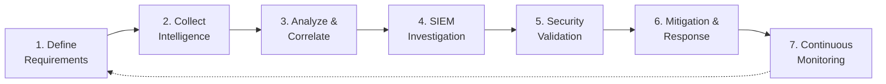

# Methodology

## Overview

The project follows an **intelligence-driven security investigation methodology** designed to explore how information collected through OSINT and Dark Web monitoring can support the identification, investigation and validation of potential threats against an organization.

Rather than treating Dark Web monitoring, SIEM analysis and penetration testing as independent activities, the methodology connects them into a continuous workflow in which findings from one stage provide context for the next.

The case study follows a simulated security incident involving a technology startup whose employee credentials are compromised following a phishing and social-engineering attack and subsequently exposed through a Dark Web forum.

The investigation is organized into the following stages:

1. Define the intelligence requirements
2. Collect external intelligence
3. Analyze and correlate collected information
4. Investigate internal security events
5. Validate potential vulnerabilities
6. Apply mitigation and defensive measures
7. Continuously monitor and improve

---

## Methodology at a Glance



The methodology is influenced by the broader **Cyber Threat Intelligence (CTI) lifecycle**, where raw information is progressively collected, processed, analyzed and transformed into intelligence that can support security decisions.

---

## 1. Define the Intelligence Requirements

Before collecting information, the investigation must establish **what information is relevant and why it matters**.

OSINT investigations can generate large volumes of data, but collecting information without a defined objective can introduce unnecessary noise and make it difficult to distinguish relevant indicators from unrelated information.

For the simulated organization, the primary intelligence requirements include identifying information that could indicate:

* exposure of employee or administrator credentials;
* unauthorized disclosure of organizational information;
* mentions of the organization on Dark Web forums or marketplaces;
* suspicious infrastructure associated with a potential threat;
* relationships between discovered entities and the organization;
* indicators that could support further internal investigation.

This stage establishes the scope of the investigation and determines which findings should progress through the rest of the security workflow.

---

## 2. External Intelligence Collection

Once the investigation requirements have been defined, information is collected from relevant external sources.

The methodology considers both conventional OSINT sources and information available through Dark Web monitoring.

Potential OSINT sources include:

* corporate websites;
* search engines;
* public records;
* historical website information;
* publicly accessible documents;
* social networks and online communities;
* technical information such as domains, IP addresses and exposed services;
* Dark Web forums, marketplaces and other monitored sources.

Techniques discussed in the research include targeted search queries, historical website analysis and <a href="https://en.wikipedia.org/wiki/Google_hacking"> **Google Dorking** </a> to identify information that may have been unintentionally exposed or indexed.

### Dark Web Collection

The practical case study uses a dedicated Ubuntu environment for Dark Web and OSINT research.

**Tor Browser** provides access to the Tor network, while **DarkOwl Vision** is used to search monitored Dark Web data for relevant information.

Searches can be based on indicators such as:

* organization names;
* domains;
* email addresses;
* credentials;
* other identifiers associated with the target.

The purpose of this stage is not indiscriminate collection. Findings are filtered according to their relevance to the intelligence requirements established at the beginning of the investigation.

---

## 3. Analysis and Correlation

Raw information alone does not constitute actionable intelligence.

Once potentially relevant information has been collected, it must be analyzed to determine its significance, origin and possible relationship with other findings.

The project uses **Maltego** to support entity and link analysis.

Collected information can be represented through entities such as:

* people;
* organizations;
* websites and domains;
* IPv4 addresses;
* cryptocurrency addresses;
* social-media accounts.

Relationships between these entities can then be investigated to identify connections that may not be immediately apparent when examining individual data points.

The objective is to transform isolated findings into contextualized information that can support subsequent security investigation.

This stage also requires attention to the **reliability and relevance of the information**. Information collected through OSINT or Dark Web sources should not automatically be considered accurate simply because it has been discovered.

---

## 4. SIEM and Log Investigation

Relevant external intelligence can then be compared with activity observed inside the monitored environment.

The case study uses **Splunk** for log collection, searching and visualization.

The investigation considers local event logs including:

* Application
* Security
* System

This stage allows analysts to investigate whether indicators discovered externally correspond to suspicious internal activity.

For example, if compromised credentials, suspicious domains or IP addresses are discovered during the intelligence-gathering stage, monitoring rules and searches can be adapted to look for related activity.

The workflow therefore connects two different perspectives:

> **External intelligence:** What information or threats concerning the organization can be observed outside its infrastructure?

and:

> **Internal monitoring:** Is there evidence that those indicators are associated with activity inside the monitored environment?

Where appropriate, SIEM correlation rules and alerts can be updated to improve detection of similar activity.

---

## 5. Controlled Security Validation

Findings from intelligence gathering and SIEM analysis can identify systems or services that require further investigation.

The next stage uses the dedicated **Kali Linux penetration-testing environment** to perform controlled security validation.

The objective is not to assume that a suspected weakness is exploitable, but to **test whether the identified condition represents an actual vulnerability within an authorized environment**.

The practical case study demonstrates this process using **Metasploit** and an SMB vulnerability assessment related to MS17-010.

The test did not identify the examined system as vulnerable to MS17-010.

This negative result remains meaningful: it demonstrates the importance of validating hypotheses generated during an investigation rather than treating every potential attack vector as a confirmed vulnerability.

Security testing is limited to systems owned by or explicitly included within the controlled lab environment.

---

## 6. Mitigation and Response

Once suspicious activity or security weaknesses have been investigated, the methodology moves from detection to response.

Depending on the findings, potential defensive actions considered in the case study include:

* isolating systems believed to be compromised or at risk;
* blocking suspicious IP addresses or domains;
* resetting compromised credentials;
* invalidating active sessions and requiring re-authentication;
* applying security patches;
* strengthening system configurations;
* updating firewall or monitoring rules;
* updating SIEM correlation and detection logic.

The project also emphasizes that technical controls alone are insufficient.

Because the simulated incident originates from phishing and social engineering, mitigation also includes organizational measures such as:

* cybersecurity awareness training;
* phishing and social-engineering education;
* secure credential-management practices;
* documented Standard Operating Procedures (SOPs);
* incident-response preparation.

---

## 7. Continuous Monitoring and Improvement

The methodology does not end when an individual incident has been investigated.

Information discovered during security validation can generate new intelligence requirements, while new OSINT or Dark Web findings can lead to additional internal monitoring or technical validation.

The resulting feedback loop can be represented as:

```text
OSINT / Dark Web Intelligence
            ↓
     Analysis & Correlation
            ↓
      SIEM Investigation
            ↓
      Security Validation
            ↓
     Mitigation / Hardening
            ↓
Updated Detection & Monitoring
            │
            └──────────────→ New Intelligence Requirements
```

Continuous improvement can include:

* monitoring Dark Web and OSINT sources for new exposure;
* reviewing newly identified threats and vulnerabilities;
* updating SIEM rules;
* periodically reviewing security policies;
* conducting authorized security assessments;
* maintaining incident-response procedures;
* providing continued security-awareness training.

This creates a security process in which intelligence collection, monitoring, validation and mitigation continuously inform one another.

---

## Relationship to the Cyber Threat Intelligence Lifecycle

The methodology shares several principles with the **Cyber Threat Intelligence lifecycle**.

The mapping below is conceptual and illustrates how the project extends beyond classical intelligence production into operational investigation and response.

| Project Stage                    | CTI Function                  |
| -------------------------------- | ----------------------------- |
| Define intelligence requirements | Direction / Planning          |
| OSINT & Dark Web collection      | Collection                    |
| Entity and relationship analysis | Processing & Analysis         |
| SIEM investigation               | Analysis / Operationalization |
| Security validation              | Validation                    |
| Mitigation and response          | Action                        |
| Continuous monitoring            | Feedback                      |

The project does not attempt to implement a complete enterprise CTI platform. Instead, the lifecycle provides a conceptual framework for organizing the investigation and demonstrating how external intelligence can contribute to operational security activities.

---

## Scope and Methodological Limitations

The methodology was developed for an **academic and simulated case study**, not as a production incident-response framework.

Several limitations should therefore be considered:

### Simulated Scenario

The organization and security incident used in the case study are simulated. The environment was created to demonstrate the interaction between OSINT, Dark Web monitoring, SIEM analysis and security validation in a controlled setting.

### Source Reliability

Information collected from OSINT and Dark Web sources can be incomplete, outdated, misleading or intentionally false.

Findings should therefore be validated and correlated with additional evidence before they are treated as confirmed intelligence.

### Tool Coverage

The thesis evaluates a broad range of OSINT and cybersecurity technologies, but the practical case study demonstrates only a subset of them. References to additional tools should therefore not be interpreted as evidence that every technology discussed was implemented in the lab.

### Limited Quantitative Evaluation

The case study primarily demonstrates the feasibility and workflow of the proposed approach rather than quantitatively benchmarking detection performance, accuracy or response times.

### Legal and Ethical Boundaries

All security-testing activities are intended for controlled and authorized environments. OSINT and Dark Web research must also respect applicable privacy, data-protection and legal requirements.

For further discussion, see [Ethics & Legal Considerations](ethics-and-legal.md).

---

## Key Methodological Principle

The central principle of the project can be summarized as:

> **Collect with a purpose, correlate before drawing conclusions, validate technical assumptions and feed the results back into monitoring and defensive controls.**

The value of OSINT and Dark Web intelligence therefore comes not simply from collecting more information, but from integrating relevant external intelligence into a structured security investigation process.
