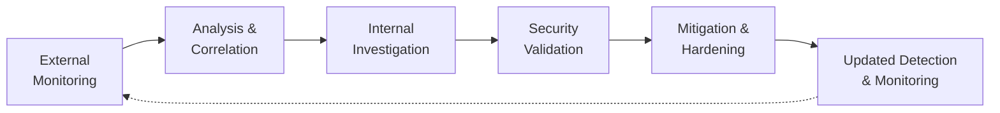

# Results

## Overview

The case study demonstrates how **OSINT, Dark Web monitoring, SIEM analysis and controlled vulnerability assessment can complement one another within a structured security investigation**.

The primary outcome of the project is therefore not a single detected vulnerability or a quantitative performance improvement. Instead, the work demonstrates an integrated workflow in which external intelligence can provide context for internal security monitoring, while technical validation can be used to verify assumptions generated during the investigation.

The results should be interpreted within the scope of an **academic and simulated environment**, rather than as measurements from a production Security Operations Center (SOC).

---

## Summary of Results

| Area                     | Outcome                                                                                                  |
| ------------------------ | -------------------------------------------------------------------------------------------------------- |
| Dark Web Monitoring      | Demonstrated how external sources can be searched for potentially relevant organizational information    |
| OSINT Analysis           | Demonstrated how collected information can be organized and correlated through entity/link analysis      |
| SIEM & Log Analysis      | Demonstrated collection, search and analysis of security-related Windows events using Splunk             |
| Vulnerability Assessment | Demonstrated controlled validation of an SMB/MS17-010 hypothesis using Metasploit                        |
| MS17-010 Test            | The tested target was **not identified as vulnerable**                                                   |
| Incident Response        | Identified appropriate containment, remediation and monitoring measures                                  |
| Overall Approach         | Demonstrated the value of connecting external intelligence, internal monitoring and technical validation |

---

# 1. Dark Web Monitoring as an Intelligence Source

The research demonstrates that Dark Web monitoring can provide an additional source of information when investigating potential organizational exposure.

Platforms such as **DarkOwl Vision** can be used to search monitored Dark Web data using indicators including domains, organization names, email addresses and other identifiers.

The value of this information does not come simply from discovering that a particular term appears in a Dark Web source.

A result must still be evaluated according to factors such as:

* relevance to the organization;
* source context;
* credibility;
* relationship with other indicators;
* potential security impact.

The project therefore treats Dark Web information as an **intelligence input requiring further analysis**, rather than automatically considering every discovered result a confirmed security incident.

---

# 2. OSINT Correlation Adds Context

The project demonstrates how individual pieces of information can be more useful when analyzed as part of a wider set of relationships.

Using **Maltego**, entities such as people, organizations, domains, email addresses and IP addresses can be represented and connected through link analysis.

This provides a way to move from isolated data points toward a contextual understanding of how information may relate to an organization or investigation.

The practical value is not simply visualization: the relationships can help determine which findings deserve additional investigation and which may be unrelated or low priority.

---

## 3. External Intelligence and Internal Monitoring Are Complementary

One of the central findings of the project is that **external threat intelligence and internal security telemetry provide different but complementary perspectives during an investigation**.

OSINT and Dark Web monitoring can reveal potential exposure outside an organization's direct infrastructure, while SIEM data provides visibility into activity recorded within monitored systems.

The practical case study used **Splunk Enterprise** to examine Windows event data and demonstrate how internal telemetry can provide additional context when evaluating information discovered externally.

The relationship can be summarized as:

```text
External Intelligence
        ↓
Potentially Relevant Indicator
        ↓
Internal Telemetry Review
        ↓
Correlation & Context
        ↓
Further Investigation
```

---

# 4. Vulnerability Hypotheses Require Validation

The controlled vulnerability assessment produced one of the clearest practical results of the case study.

Using **Metasploit Framework**, the lab target was assessed for the SMB vulnerability associated with **MS17-010**.

The scan completed without identifying the tested system as vulnerable.

```text
Potential Attack Vector
        ↓
Technical Assessment
        ↓
No Vulnerability Detected
        ↓
Hypothesis Not Confirmed
```

Although this is a negative result, it is still significant.

A visible service, suspicious event or theoretical attack path should **not be interpreted as evidence of an exploitable vulnerability without technical validation**.

This stage demonstrates the importance of distinguishing between:

* an indicator;
* a hypothesis;
* a validated security finding.

The assessment therefore supported the investigation by preventing an unsupported vulnerability assumption from being treated as a confirmed result.

---

# 5. Security Requires More Than Technical Detection

The case study also highlights that technical investigation alone is insufficient to address organizational security risk.

Because the simulated incident begins with phishing and social engineering, the resulting recommendations include both technical and organizational controls.

### Technical Measures

Potential measures identified during the project include:

* credential resets and session invalidation;
* system isolation where compromise is suspected;
* blocking suspicious IP addresses and domains;
* patching and configuration hardening;
* firewall-rule updates;
* SIEM detection and correlation-rule improvements;
* continued monitoring of relevant indicators.

### Organizational Measures

The research also emphasizes:

* employee cybersecurity awareness;
* phishing and social-engineering training;
* documented Standard Operating Procedures (SOPs);
* incident-response preparation;
* periodic authorized security assessments;
* continuous review of security policies.

The project therefore reinforces a **defense-in-depth perspective**, where monitoring and technical controls are complemented by organizational preparedness and user awareness.

---

# 6. Continuous Monitoring Is a Core Requirement

A further conclusion of the project is that threat intelligence should not be treated as a one-time investigation.

Organizations operate in an environment where:

* new vulnerabilities are discovered;
* exposed information can appear over time;
* attacker techniques evolve;
* credentials can become compromised;
* organizational infrastructure changes.

The proposed approach therefore relies on a continuous feedback process:



The objective is to allow new intelligence and previous investigation results to continuously improve the organization's security posture.

---

# What the Project Demonstrated

Within the scope of the academic case study, the project demonstrated that:

1. **OSINT and Dark Web monitoring can provide useful external context** for security investigations.
2. **Raw information requires correlation and validation** before it can become useful intelligence.
3. **External indicators can complement internal SIEM analysis** by providing additional context for event investigation.
4. **Security-testing tools can validate investigation hypotheses** rather than relying on assumptions.
5. **A negative vulnerability result is still meaningful**, because it prevents an unsupported hypothesis from becoming a false finding.
6. **Security response requires both technical and organizational measures.**
7. **Continuous monitoring and feedback are important** because both threats and organizational exposure evolve over time.

---

# What the Project Did Not Demonstrate

To avoid overstating the results, the project should also be clear about what was **not** established by the case study.

The project did not:

* measure a numerical improvement in detection accuracy;
* benchmark SIEM performance or response time;
* demonstrate that the proposed workflow prevents a specific percentage of attacks;
* implement a complete enterprise SOC or threat-intelligence platform;
* demonstrate exploitation of MS17-010 against the tested system;
* validate every OSINT or cybersecurity technology discussed in the thesis through hands-on testing;
* evaluate the approach against a large dataset of real-world corporate incidents.

These limitations are important when interpreting the conclusions of the project.

---

# Overall Conclusion

The project supports the thesis that **Dark Web intelligence can become more useful to organizational security when it is integrated with a broader investigative process rather than treated as an isolated source of information**.

The proposed workflow connects:

**external intelligence → analysis and correlation → internal monitoring → technical validation → mitigation → continuous monitoring**

This integration provides a structured way to move from discovering potentially relevant information to evaluating its significance and determining an appropriate security response.

At the same time, the case study demonstrates that tools alone are not sufficient. Effective security also depends on **validation, continuous monitoring, employee awareness, incident-response preparation and regularly updated security policies**.

The project therefore presents OSINT and Dark Web monitoring as complementary components of a broader, continuously evolving cybersecurity strategy.

---

## Related Documentation

* [Architecture](architecture.md): isolated lab architecture and environment separation
* [Methodology](methodology.md): investigation methodology and workflow
* [Case Study](case-study.md): practical application of the methodology
* [Tools Evaluated](tools-evaluated.md): technologies used and researched
* [Ethics & Legal Considerations](ethics-and-legal.md): privacy, authorization and responsible research
