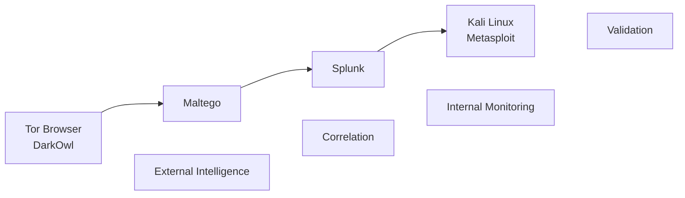

# Tools & Technologies Evaluated

## Overview

The thesis examines a broad ecosystem of technologies related to **OSINT, Dark Web intelligence, security monitoring and vulnerability assessment**.

Not every technology discussed during the research was implemented in the practical case study.

To accurately represent the scope of the project, the technologies below are separated according to their role in the work:

| Classification               | Meaning                                                                                                         |
| ---------------------------- | --------------------------------------------------------------------------------------------------------------- |
| **Practically Demonstrated** | Used directly during the practical case study or lab activities documented in the thesis                        |
| **Evaluated / Explored**     | Examined as relevant technologies or potential components of the proposed workflow                              |
| **Referenced in Research**   | Discussed while surveying the wider OSINT and cybersecurity ecosystem, without implying hands-on implementation |

Note: **A technology appearing in the thesis should not automatically be interpreted as evidence of practical experience with that technology.**

---

# Practically Demonstrated

## Oracle VM VirtualBox

**Category:** Virtualization / Lab Infrastructure

VirtualBox provides the virtualization layer used to separate the different functions of the practical security lab.

The environment was divided into dedicated systems for:

* OSINT and Dark Web monitoring;
* SIEM and log management;
* penetration testing.

Virtualization also provided isolation between security-sensitive activities and the host environment.

**Project role:** Lab isolation and separation of responsibilities.

---

## Ubuntu Linux

**Category:** Operating System / OSINT Environment

An Ubuntu-based virtual machine was used as the environment dedicated to OSINT and Dark Web research.

This environment supported activities including external intelligence collection, Dark Web access and analysis.

**Project role:** OSINT and Dark Web monitoring workstation.

---

## Tor Browser

**Category:** Dark Web Access / Privacy

Tor Browser was used within the isolated OSINT environment to access services available through the Tor network.

Its role in the project was limited to controlled Dark Web research conducted as part of the academic case study.

**Project role:** Access to Tor-based resources.

---

## DarkOwl Vision

**Category:** Dark Web Intelligence

DarkOwl Vision was explored practically as a platform for searching information collected from Dark Web sources.

The platform supports searches based on indicators such as:

* domains;
* email addresses;
* organization-related terms;
* credentials and identifiers.

Search results provide additional context such as source information, crawl dates and relevance indicators.

Within the project, DarkOwl demonstrates how Dark Web information can become an external intelligence source within a broader security investigation.

**Project role:** Dark Web intelligence search and analysis.

---

## Maltego

**Category:** OSINT / Link Analysis

Maltego was used to explore relationships between information discovered during OSINT research.

The platform represents information through entities and links, allowing relationships between elements such as:

* people;
* organizations;
* websites and domains;
* email addresses;
* IPv4 addresses;
* social accounts;
* cryptocurrency addresses

To be visualized and investigated.

**Project role:** Entity correlation and relationship analysis.

---

## Splunk Enterprise

**Category:** SIEM / Log Analysis

Splunk Enterprise was used in the practical environment to collect, search and analyze system events.

The case study examines Windows event-log categories including:

* `Application`
* `Security`
* `System`

Events could then be investigated using attributes including host, source, source type, timestamp and event code.

Within the proposed workflow, Splunk represents the internal-monitoring layer that can be informed by indicators discovered through external intelligence.

**Project role:** Security-event collection, search, visualization and investigation.

---

## Kali Linux

**Category:** Penetration Testing / Security Validation

A dedicated Kali Linux virtual machine was used for controlled security-testing activities.

Separating this environment from the OSINT and monitoring systems provided a dedicated platform from which potential weaknesses could be investigated within the authorized lab.

**Project role:** Controlled vulnerability-assessment environment.

---

## Metasploit Framework

**Category:** Vulnerability Assessment / Penetration Testing

Metasploit Framework was used to demonstrate the technical-validation stage of the investigation.

The practical case study assessed an SMB service for the vulnerability associated with **MS17-010**.

The scanner completed without identifying the tested system as vulnerable.

This result demonstrates an important principle of the project: a potential attack vector should be technically validated rather than automatically treated as a confirmed vulnerability.

**Project role:** Controlled validation of a vulnerability hypothesis.

---

# Evaluated / Explored

The following technologies were examined in greater detail during the thesis as tools relevant to the proposed OSINT and security workflow, but the supplied practical evidence does not support presenting them at the same hands-on level as the technologies above.

## OSINT Framework

**Category:** OSINT Resource Discovery

OSINT Framework organizes resources for gathering publicly available information across multiple intelligence categories.

The thesis examines it as a way of identifying appropriate tools and sources during an OSINT investigation.

**Potential role:** OSINT source and tool discovery.

---

## SpiderFoot

**Category:** Automated OSINT

SpiderFoot is examined as an OSINT automation platform capable of gathering information from multiple sources and correlating results.

The thesis discusses capabilities such as:

* domain and IP investigation;
* email and identity research;
* API-based data collection;
* relationship discovery;
* automated OSINT workflows.

**Potential role:** Automated reconnaissance and intelligence aggregation.

> SpiderFoot's inclusion in the thesis does not by itself demonstrate that a custom SpiderFoot automation or API integration was implemented during the case study.

---

## Shodan

**Category:** Internet-Exposed Asset Intelligence

Shodan is evaluated as a search engine for internet-connected systems and services.

Relevant security applications discussed in the thesis include identifying exposed infrastructure, services, ports and potentially vulnerable devices.

**Potential role:** External attack-surface and exposed-service reconnaissance.

---

## Have I Been Pwned (HIBP)

**Category:** Breach Exposure Intelligence

Have I Been Pwned is examined as a service for determining whether email addresses or accounts appear in known data breaches.

Within the wider workflow, such a service can provide additional context when investigating potential credential exposure.

**Potential role:** Known breach and credential-exposure checking.

---

## Nmap

**Category:** Network Reconnaissance

Nmap is discussed as a network-discovery and security-assessment tool capable of identifying hosts, open ports and available services.

**Potential role:** Network reconnaissance and service enumeration.

---

## Burp Suite

**Category:** Web Application Security

Burp Suite is discussed as a platform for assessing web applications and analyzing HTTP/HTTPS communication.

**Potential role:** Web-application security assessment.

---

# Referenced in Research

The thesis also surveys a much wider range of technologies and techniques to provide context around modern OSINT and cybersecurity investigations.

These technologies are included here for completeness and **should not be interpreted as technologies implemented or practically evaluated during the case study**.

## Data Collection & Web Scraping

Technologies discussed include:

* Scrapy
* Apify
* Puppeteer
* Selenium
* Scrapy-Splash

These are presented in the thesis as examples of frameworks for automated web collection, dynamic browsing and large-scale data extraction.

---

## Social Media Intelligence

The research discusses technologies including:

* Brandwatch
* Crimson Hexagon
* Synthesio
* Gephi
* NodeXL

These are considered in relation to social-media monitoring, network analysis, community identification and relationship discovery.

---

## Cryptocurrency & Blockchain Intelligence

Examples discussed include:

* Chainalysis
* Elliptic

These technologies are referenced in relation to tracing cryptocurrency transactions and investigating activity potentially associated with Dark Web ecosystems.

---

## Network Security & Traffic Analysis

The wider research discusses:

* Zeek
* Suricata
* SiLK
* Argus

These technologies are considered for network-behavior monitoring, flow analysis and identification of potentially suspicious traffic patterns.

---

## Digital Forensics & Malware Analysis

Technologies referenced include:

* Volatility
* Rekall
* The Sleuth Kit
* EnCase
* FTK
* Cuckoo Sandbox
* Joe Sandbox

They are discussed as examples of technologies used for memory forensics, disk analysis and controlled malware investigation.

---

## Data Visualization & Link Analysis

In addition to Maltego, the thesis references:

* Neo4j
* Gephi
* Palantir
* Tableau
* Power BI
* D3.js

These technologies are discussed in the context of data visualization, graph analysis and identifying relationships within large information sets.

---

## Geospatial Intelligence

Examples referenced include:

* ArcGIS
* QGIS
* ENVI

These technologies appear in the broader discussion of GEOINT, geospatial analysis and visualization.

---

## Artificial Intelligence & Machine Learning

The research also examines the potential application of techniques including:

* Natural Language Processing (NLP);
* Named Entity Recognition (NER);
* sentiment analysis;
* computer vision;
* anomaly detection;
* predictive analytics.

These technologies are discussed as possible methods for processing and analyzing large volumes of intelligence data.

---

# Technology Mapping

The core practical workflow can be summarized as:

| Security Function            | Technology Demonstrated |
| ---------------------------- | ----------------------- |
| Virtualization               | Oracle VM VirtualBox    |
| OSINT Environment            | Ubuntu Linux            |
| Dark Web Access              | Tor Browser             |
| Dark Web Intelligence        | DarkOwl Vision          |
| Entity / Link Analysis       | Maltego                 |
| SIEM / Log Analysis          | Splunk Enterprise       |
| Security Testing Environment | Kali Linux              |
| Vulnerability Validation     | Metasploit Framework    |

Conceptually:

---

# Skills Represented by the Toolset

Based specifically on the technologies demonstrated in the practical case study, the project provides evidence of exposure to:

* Linux-based security environments;
* virtualization and isolated lab design;
* OSINT research;
* Dark Web monitoring;
* entity and link analysis;
* security-event and log investigation;
* SIEM concepts;
* controlled vulnerability assessment;
* basic penetration-testing workflow;
* security-tool integration at a conceptual/workflow level;
* technical research and documentation.

These should be understood within the scope of an **academic cybersecurity project**, rather than as claims of professional production experience with each platform.

---

## Related Documentation

* [Architecture](architecture.md): how the technologies are organized within the lab
* [Methodology](methodology.md): how the investigation progresses through each stage
* [Case Study](case-study.md): practical application of the tools
* [Results](results.md): findings and conclusions
* [Ethics & Legal Considerations](ethics-and-legal.md): responsible use and authorization
