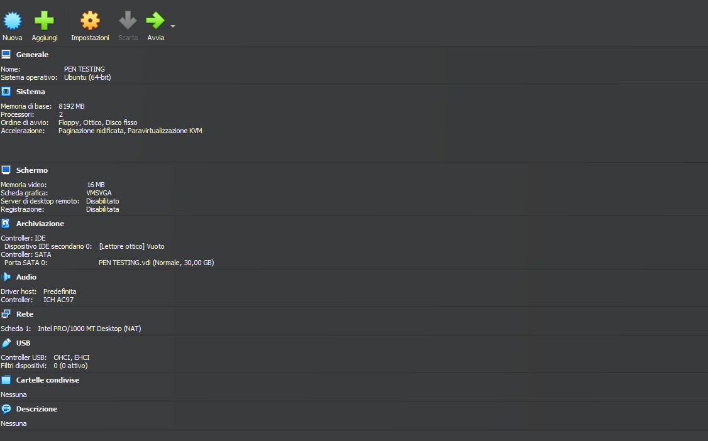
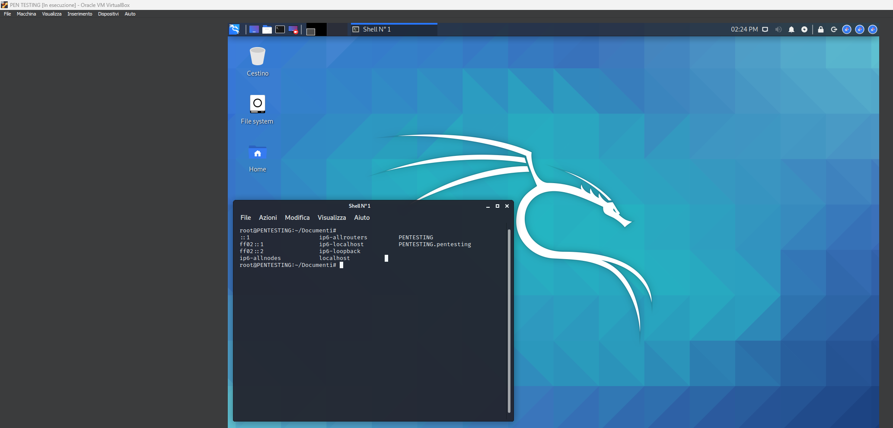

# Penetration Testing Lab

## Overview

This environment represents the **controlled technical-validation component** of the project laboratory.

A dedicated virtual machine was used to investigate potential security weaknesses identified during the broader OSINT and SIEM-driven investigation.

The purpose of this environment was not unrestricted exploitation. Instead, it was designed to **validate security hypotheses within an authorized and controlled lab environment**.

The penetration-testing VM represents the final technical stage of the investigation workflow:

```text
External Intelligence
        ↓
SIEM Investigation
        ↓
Security Hypothesis
        ↓
Controlled Validation
        ↓
Confirmed / Rejected Finding
        ↓
Mitigation & Hardening
```

---

## Lab Environment

The penetration-testing environment was deployed as a dedicated virtual machine using **Oracle VM VirtualBox**.

| Component | Configuration |
|---|---|
| **VM Name** | PEN TESTING |
| **Hypervisor** | Oracle VM VirtualBox |
| **Operating System** | Kali Linux |
| **VirtualBox OS Profile** | Ubuntu (64-bit) |
| **Hostname** | PENTESTING |
| **Memory** | 8 GB RAM |
| **Processors** | 2 vCPUs |
| **Storage** | 30 GB VDI |
| **Network** | NAT |
| **Graphics Controller** | VMSVGA |
| **Shared Folders** | None |

> **Configuration Note:** The VirtualBox VM profile is configured as `Ubuntu (64-bit)`, while the guest operating system installed and used for the penetration-testing environment is **Kali Linux**.

<p align="center">
  
</p>

<p align="center">
  <em>VirtualBox configuration of the dedicated penetration-testing environment.</em>
</p>

<p align="center">
  
</p>

<p align="center">
  <em>VirtualBox configuration of the dedicated penetration-testing virtual machine.</em>
</p>

### Kali Linux Environment

The virtual machine runs **Kali Linux** as the guest operating system, providing the security-testing environment used during the practical assessment.

<p align="center">
  
</p>

<p align="center">
  <em>Kali Linux running inside the dedicated PEN TESTING virtual machine.</em>
</p>

---

## Purpose

The environment was created to support three main activities:

### 1. Security Hypothesis Validation

Potential weaknesses identified during OSINT research or SIEM analysis should not automatically be treated as confirmed vulnerabilities.

The penetration-testing environment provides a controlled platform for testing whether a suspected weakness can actually be reproduced.

### 2. Vulnerability Assessment

Security tools were used to evaluate selected services and potential vulnerabilities within the authorized lab environment.

The practical case study focused specifically on an **SMB vulnerability assessment related to MS17-010**.

### 3. Feedback to Defensive Controls

The outcome of technical validation can inform:

- patching decisions;
- configuration hardening;
- SIEM monitoring rules;
- further investigation;
- future vulnerability assessments.

The penetration-testing environment therefore complements the defensive workflow rather than operating independently from it.

---

## Tools Used

| Tool | Role in the Lab |
|---|---|
| **Kali Linux** | Operating system and security-testing environment |
| **Metasploit Framework** | Vulnerability assessment and technical validation |
| **Oracle VM VirtualBox** | Virtualization platform hosting the laboratory environment |

The thesis also discusses tools such as **Nmap** and **Burp Suite** as components of a broader penetration-testing workflow.

However, the practical evidence documented in this project focuses primarily on **Metasploit Framework**.

> See [`../../docs/tools-evaluated.md`](../../docs/tools-evaluated.md) for the distinction between tools practically demonstrated, evaluated, and referenced during the thesis.

---

## Testing Approach

The penetration-testing stage follows a simple principle:

> **A suspected weakness is a hypothesis until it is technically validated.**

The workflow can be represented as:

```text
Potential Weakness
        ↓
Define Test Scope
        ↓
Select Validation Method
        ↓
Run Authorized Assessment
        ↓
Analyze Evidence
       / \
      /   \
Confirmed  Not Confirmed
   ↓            ↓
Remediate    Document Result
```

The objective is to obtain sufficient technical evidence to support or reject the security hypothesis without exceeding the authorized scope.

---

## Practical Assessment

### SMB / MS17-010 Validation

The practical case study demonstrates vulnerability validation using **Metasploit Framework**.

The tested system exposed the SMB service on port:

```text
TCP/445
```

The assessment focused on the vulnerability associated with **MS17-010**, historically known for its role in attacks involving the EternalBlue exploit and ransomware outbreaks.

The objective was to determine whether the authorized target appeared susceptible to this vulnerability.

---

## Metasploit Workflow

The Metasploit Framework console was launched using:

```bash
sudo msfconsole
```

A search was then performed for SMB scanner modules.

The practical case study used the MS17-010 SMB scanner module:

```text
auxiliary/scanner/smb/smb_ms17_010
```

The target host was configured using `RHOSTS` before executing the assessment.

Conceptually:

```text
Start Metasploit
      ↓
Identify SMB Scanner
      ↓
Select MS17-010 Module
      ↓
Configure Target
      ↓
Run Assessment
      ↓
Review Result
```

---

## Practical Evidence

### MS17-010 Vulnerability Assessment

The following screenshot shows the controlled SMB assessment executed using Metasploit Framework.

<p align="center">
  
</p>

<p align="center">
  <em>Controlled MS17-010 SMB vulnerability assessment performed against the authorized lab target.</em>
</p>

The scan completed without identifying the target as vulnerable to MS17-010.

---

## Result

The assessment result was:

> **The tested target was not identified as vulnerable to MS17-010.**

This is an important outcome.

The purpose of vulnerability assessment is not to produce a successful exploit, but to determine whether the available evidence supports a security hypothesis.

In this case:

```text
SMB Service Detected
        ↓
MS17-010 Hypothesis
        ↓
Controlled Assessment
        ↓
Vulnerability Not Detected
        ↓
Hypothesis Not Confirmed
```

The result therefore prevented a potential attack vector from being incorrectly treated as a confirmed vulnerability.

---

## Why the Negative Result Matters

A negative vulnerability result still provides useful security information.

It demonstrates that:

- an exposed service does not automatically imply a vulnerability;
- known attack techniques must be validated against the actual system;
- security findings should be evidence-based;
- vulnerability scanners and exploitation frameworks should support investigation rather than dictate conclusions;
- unnecessary remediation can be avoided when a suspected vulnerability is not confirmed.

This distinction is especially important in professional security assessments, where incorrect findings can create unnecessary risk, cost, and operational disruption.

---

## Relationship with the Wider Investigation

The penetration-testing environment is not intended to operate as an isolated offensive-security component.

It receives investigative context from earlier stages of the project.

```text
OSINT / Dark Web
       ↓
External Indicators
       ↓
SIEM Investigation
       ↓
Suspicious Service / Activity
       ↓
Penetration Testing
       ↓
Technical Validation
       ↓
Security Decision
```

This creates an **intelligence-driven validation process**.

Rather than testing systems without context, security assessment can focus on areas identified during previous investigation stages.

---

## Observations

The penetration-testing environment demonstrated an important separation between:

```text
Indicator
   ↓
Hypothesis
   ↓
Assessment
   ↓
Evidence
   ↓
Finding
```

An IP address, service, log event, or external intelligence indicator may justify additional investigation, but it does not automatically prove that a vulnerability exists.

Technical validation provides the evidence required to move from suspicion to a defensible security conclusion.

---

## Limitations

This environment represents an **academic vulnerability-assessment laboratory**, not a full penetration-testing engagement.

Important limitations include:

- the practical case study focused on a limited number of validation activities;
- the documented assessment primarily demonstrates Metasploit usage;
- no complete network penetration test was performed;
- no extensive web-application testing workflow was implemented;
- no privilege-escalation or post-exploitation workflow was demonstrated;
- no Red Team exercise was conducted;
- the project does not claim professional penetration-testing experience;
- testing was limited to controlled and authorized systems.

The environment therefore demonstrates **foundational vulnerability-assessment and technical-validation skills** rather than a complete offensive-security methodology.

---

## Future Improvements

This environment could be expanded with additional controlled security-testing activities.

Potential extensions include:

- structured network reconnaissance;
- service enumeration;
- additional vulnerability assessments;
- intentionally vulnerable machines;
- web-application security testing;
- authentication and access-control testing;
- repeatable vulnerability-assessment procedures;
- integration of findings with SIEM and threat-intelligence workflows;
- detection-and-response exercises based on simulated attacks.

Future implementations could also introduce additional tools where appropriate, such as:

- Nmap for host and service discovery;
- Burp Suite for web-application assessment;
- dedicated intentionally vulnerable environments for authorized testing.

These extensions would remain separate from the original thesis implementation and should be documented as additional portfolio work.

See [`../../docs/future-work.md`](../../docs/future-work.md) for the broader project development roadmap.

---

## Security & Ethical Considerations

Security-testing tools are dual-use technologies and must be used within clearly defined legal and ethical boundaries.

The penetration-testing environment follows several fundamental principles:

- test only systems that are owned or explicitly authorized;
- define the target scope before testing;
- avoid unnecessary exploitation;
- use the minimum level of interaction required to validate a hypothesis;
- do not access unrelated data;
- document findings accurately;
- distinguish suspected vulnerabilities from validated findings;
- avoid publishing sensitive technical information unnecessarily;
- apply responsible disclosure principles when genuine vulnerabilities are identified.

The MS17-010 assessment documented in this project was performed within a **controlled academic laboratory environment**.

The presence of a reachable service or suspected vulnerability on an external system does not constitute permission to test or exploit it.

For the complete discussion of authorization and responsible security research, see [`../../docs/ethics-and-legal.md`](../../docs/ethics-and-legal.md).

---

## Related Documentation

* [Project Architecture](../../docs/architecture.md): Complete laboratory architecture and separation of environments
* [Methodology](../../docs/methodology.md): Investigation methodology and workflow
* [Case Study](../../docs/case-study.md): Complete simulated security incident
* [Results](../../docs/results.md): Findings and conclusions from the investigation
* [Tools Evaluated](../../docs/tools-evaluated.md): Technologies demonstrated, evaluated and referenced
* [Ethics & Legal](../../docs/ethics-and-legal.md): Responsible research, authorization and privacy considerations
* [Future Work](../../docs/future-work.md): Proposed technical extensions to the laboratory
* [OSINT Monitoring Lab](../osint-monitoring/README.md): External intelligence collection environment
* [SIEM Lab](../siem/README.md): Internal monitoring and log-analysis environment
