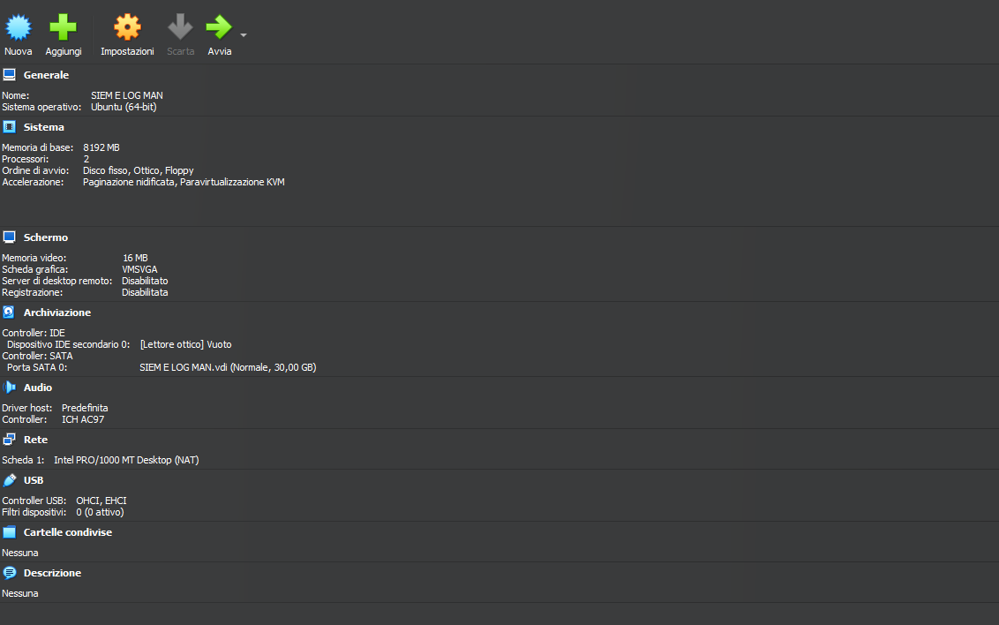

# SIEM & Log Management Lab

## Overview

This environment represents the **internal monitoring and log-analysis component** of the project laboratory.

A dedicated Ubuntu virtual machine was created to host the SIEM environment and separate security-event analysis from the OSINT/Dark Web and vulnerability-assessment components of the lab.

The environment was used to collect, search and analyze security-related events within the simulated infrastructure using **Splunk Enterprise**.

The SIEM component forms the internal-analysis stage of the broader investigation workflow:

```text
External Intelligence
        ↓
Relevant Indicators
        ↓
Internal Security Events
        ↓
SIEM & Log Analysis
        ↓
Investigation
        ↓
Technical Validation
```

---

## Lab Environment

The SIEM environment was deployed as a dedicated virtual machine using **Oracle VM VirtualBox**.

| Component | Configuration |
|---|---|
| **VM Name** | SIEM E LOG MAN |
| **Hypervisor** | Oracle VM VirtualBox |
| **Operating System** | Ubuntu Linux (64-bit) |
| **Memory** | 8 GB RAM |
| **Processors** | 2 vCPUs |
| **Storage** | 30 GB VDI |
| **Network** | NAT |
| **Graphics Controller** | VMSVGA |
| **Shared Folders** | None |

The dedicated VM provides separation between log-analysis activities and the other laboratory components while allowing Splunk to operate within its own controlled environment.

<p align="center">
  
</p>

<p align="center">
  <em>VirtualBox configuration of the dedicated Ubuntu SIEM and log-management environment.</em>
</p>

---

## Purpose

The environment was designed to support three main activities:

### 1. Log Collection

Security-related events generated within the monitored environment were made available for centralized analysis.

The practical case study focused on Windows event categories including:

- **Application**
- **Security**
- **System**

These logs provide visibility into activity occurring inside the simulated infrastructure.

### 2. Event Search & Investigation

Splunk Enterprise was used to search and filter collected events based on attributes such as:

- host;
- source;
- event category;
- event code;
- timestamp;
- other available event fields.

This allowed relevant activity to be isolated from the wider event dataset during the investigation.

### 3. Intelligence Correlation

The SIEM environment provides the internal perspective of the investigation.

Indicators identified during OSINT and Dark Web research can be compared with internal telemetry to determine whether corresponding activity is visible within the monitored environment.

```text
External Indicator
        +
Internal Event
        ↓
Correlation
        ↓
Investigation Context
```

This helps prevent external intelligence from being treated as confirmed evidence without additional validation.

---

## Tools Used

| Tool | Role in the Lab |
|---|---|
| **Ubuntu Linux** | Base operating system for the dedicated SIEM environment |
| **Splunk Enterprise** | Centralized event search, analysis and visualization |
| **Windows Event Logs** | Internal telemetry analyzed during the practical case study |
| **Oracle VM VirtualBox** | Virtualization platform used to host the laboratory environment |

> **Note:** The thesis also discusses alternative SIEM and log-management technologies such as the Elastic Stack. This page documents the practical environment implemented using Splunk Enterprise.

For the broader technology assessment, see [`../../docs/tools-evaluated.md`](../../docs/tools-evaluated.md).

---

## Environment Role

The SIEM environment sits between external intelligence collection and technical security validation.

```text
OSINT / Dark Web Monitoring
            ↓
     Relevant Indicators
            ↓
        SIEM Analysis
            ↓
    Internal Validation
            ↓
Potential Security Hypothesis
            ↓
Controlled Vulnerability Assessment
```

The objective is not to treat every external indicator as evidence of malicious activity.

Instead, the SIEM stage provides additional context by comparing external intelligence with internal events.

---

## Data Sources

The practical analysis documented in the case study focused on Windows event logs.

### Application Logs

Application events can provide information related to software behavior, errors, warnings and other application-level activity.

### Security Logs

Security events can provide visibility into authentication, access and other security-relevant activity recorded by the Windows operating system.

### System Logs

System events can provide information about operating-system services, drivers, failures and general system activity.

```text
Windows Host
     │
     ├── Application
     │
     ├── Security
     │
     └── System
            ↓
         Splunk
            ↓
      Event Analysis
```

---

## Investigation Workflow

The practical SIEM investigation followed a structured sequence.

### Step 1 — Collect Events

Security-related events from the monitored environment are made available within Splunk.

### Step 2 — Search the Dataset

Initial searches are used to review the available event data and identify potentially relevant activity.

### Step 3 — Filter Events

Results can be narrowed using attributes such as:

- host;
- source;
- event code;
- event type;
- timestamp.

This reduces the amount of unrelated information presented to the analyst.

### Step 4 — Investigate Relevant Events

Events considered relevant to the simulated incident are examined in greater detail.

### Step 5 — Correlate with External Intelligence

Relevant information identified during OSINT or Dark Web research can be compared against internal telemetry.

### Step 6 — Form a Security Hypothesis

The combined external and internal evidence can support a hypothesis requiring further technical validation.

```text
Collected Logs
     ↓
Initial Search
     ↓
Event Filtering
     ↓
Relevant Events
     ↓
External Indicator Correlation
     ↓
Security Hypothesis
     ↓
Technical Validation
```

---

## Splunk Analysis

Splunk Enterprise provided a centralized interface for exploring the event data generated within the monitored environment.

The practical investigation demonstrated:

- event ingestion and visualization;
- general event searching;
- filtering by event attributes;
- examination of Windows event categories;
- investigation of individual security events.

The objective of the SIEM stage was to provide **internal investigative context**, rather than implementing a complete production SOC or advanced detection-engineering platform.

---

## Practical Evidence

### Windows Event Analysis

The following screenshot demonstrates event analysis performed using Splunk Enterprise during the practical case study.

<p align="center">
  
</p>

<p align="center">
  <em>Analysis and filtering of Windows events within Splunk Enterprise.</em>
</p>

The interface provides visibility into collected events and allows the analyst to narrow results based on available event metadata.

---

## Observations

The SIEM environment demonstrated the importance of combining **external intelligence with internal telemetry**.

External information may indicate that an organization or account could be exposed, but that information alone does not establish what occurred inside the organization's systems.

Similarly, internal events may show suspicious activity without immediately providing external context.

Combining both perspectives provides a more complete investigation model:

```text
External Intelligence
        +
Internal Telemetry
        ↓
Correlation
        ↓
Context
        ↓
Security Investigation
```

The SIEM therefore acts as a bridge between the external-intelligence and technical-validation stages of the project.

---

## Results

The practical SIEM component demonstrated the ability to:

- collect and review Windows event data;
- search security-related events using Splunk;
- filter results by relevant event attributes;
- investigate individual events;
- use internal telemetry as an additional source of evidence within the broader investigation workflow.

The environment was used primarily for **exploratory investigation and event analysis**.

It should not be interpreted as evidence of a fully implemented production detection-engineering or SOC platform.

---

## Limitations

This environment represents an **academic SIEM laboratory** and not a production enterprise monitoring platform.

Notable limitations include:

- a limited number of monitored systems;
- a limited set of event sources;
- no large-scale distributed Splunk architecture;
- no production threat-intelligence feed integration;
- no extensive custom detection-rule library;
- no automated incident-response workflow;
- limited automation between OSINT findings and SIEM events;
- analysis remained primarily manual.

Future versions of the laboratory could expand this component with additional data sources, detection rules and automated intelligence correlation.

See [`../../docs/future-work.md`](../../docs/future-work.md) for the proposed development roadmap.

---

## Future SIEM Improvements

Potential extensions to this environment include:

- additional Windows and Linux log sources;
- centralized authentication telemetry;
- network IDS/IPS events;
- endpoint security telemetry;
- custom Splunk dashboards;
- custom detection rules;
- alerts for suspicious authentication activity;
- automated enrichment of relevant indicators;
- correlation between threat-intelligence feeds and internal logs;
- repeatable detection-and-response exercises.

These improvements could evolve the environment from primarily manual event analysis toward a more comprehensive security-monitoring laboratory.

---

## Security & Ethical Considerations

Security logs can contain sensitive technical and personal information.

The SIEM environment should therefore follow responsible data-handling principles, including:

- collect only logs necessary for the investigation;
- restrict access to security telemetry;
- avoid publishing sensitive event information;
- sanitize screenshots before public release;
- minimize unnecessary retention of personal data;
- ensure monitored systems are authorized for analysis;
- separate simulated evidence from real-world claims;
- validate conclusions before attributing malicious activity.

The project uses collected event data solely for **academic research and defensive-security analysis**.

For the complete discussion of privacy, authorization and responsible security research, see [`../../docs/ethics-and-legal.md`](../../docs/ethics-and-legal.md).

---

## Related Documentation

| Document | Description |
|---|---|
| [Project Architecture](../../docs/architecture.md): Complete laboratory architecture and separation of environments |
| [Methodology](../../docs/methodology.md): Investigation methodology and workflow |
| [Case Study](../../docs/case-study.md): Complete simulated security incident |
| [Results](../../docs/results.md): Findings and conclusions from the investigation |
| [Tools Evaluated](../../docs/tools-evaluated.md): Technologies demonstrated, evaluated and referenced |
| [Ethics & Legal](../../docs/ethics-and-legal.md): Responsible research, privacy and legal considerations |
| [Future Work](../../docs/future-work.md): Proposed technical extensions to the laboratory |
| [OSINT Monitoring Lab](../osint-monitoring/README.md): External intelligence collection environment |

---

[← Back to main project](../../README.md)
